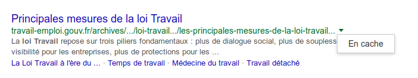

Recherche avancée d'informations
======================

Google Dorking
================

Opérateurs
----------

  * "expression exacte"
  * OR &#8680; ce terme OU l'autre terme : *Google OR vie privée*
  * \- &#8680; mot à exclure de la recherche : *Google -privacy*
  * \* &#8680; caractère joker : <em>rock * roll</em>
  * 10..20 &#8680; échelle :  *Sarkozy 2002..2003*
  * in  &#8680; conversion : *250 $ in €*

Cibles
--------
  * intitle: Titre de la page
  * site:monsite.com ou site:.edu
  * inurl: termes précis dans l'url
  * intext: dansle corps de page
  * filetype:pdf
  * link:http://www.cfjparis.com/ (déprécié)

Combinaisons
-------------  

    "Macron" intitle:"top 5..10 facts" -site:youtube.com inurl:2015

Juicy stuffs
-------------  
    intitle:”curriculum vitae” “Tel * * *” “adresse *” “e-mail” 

Recherche de plagiat
--------------------
    intext:"ma phrase pompée ailleurs" -site:monsite.com 

Trouver d'autres TLD
---------------------
    site:amazon.* -site:amazon.com

Recherche twitter
-------------------
    site:twitter.com & intext:dvdrip

Le cache
--------

Le couteau suisse
=================   

[Intel techniques search tools](https://inteltechniques.com/menu.html)

Note: Top searches : username et documents
Pour les profils linkedin ou autre : utilisez de faux profils

Des outils adaptés
==================
  * [Profiling de compte twitter](https://github.com/x0rz/tweets_analyzer)
  * Les outils de Leaks
  * Recherche dans des fichiers en masse : "grep est ton ami"
  * Whois

Références
==========
  * https://moz.com/learn/seo/search-operators
  * https://moz.com/blog/mastering-google-search-operators-in-67-steps
  * http://www.tekgyd.com/2015/07/how-to-use-google-dork-for-hacking.html
  * https://www.exploit-db.com/google-hacking-database/

